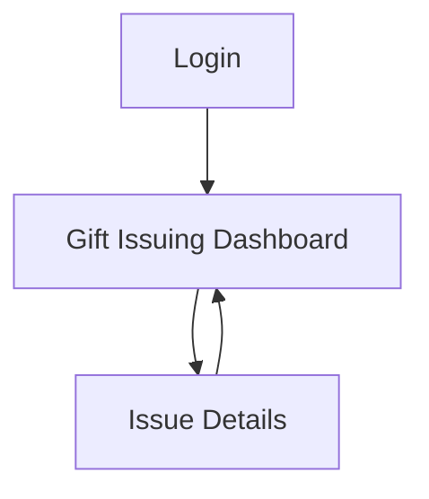

## 1. Product Overview
A web app for staff to securely issue gifts to recipients and keep an auditable record.
It uses an existing Supabase database schema and existing RLS policies to enforce access rules.

## 2. Core Features

### 2.1 User Roles
| Role | Registration Method | Core Permissions |
|------|---------------------|------------------|
| Issuer (Staff) | Supabase Auth (email/password or SSO as configured) | Can search recipients, issue gifts, view permitted gift history per existing RLS |
| Admin (Optional) | Supabase Auth + admin flag/claim (as enforced by existing RLS) | Can view broader history and manage records only if RLS allows |

### 2.2 Feature Module
Our gift issuing requirements consist of the following main pages:
1. **Login**: authenticate, handle session state.
2. **Gift Issuing Dashboard**: recipient lookup, gift selection, issue workflow, recent activity.
3. **Issue Details**: view a single issued gift record and its audit fields.

### 2.3 Page Details
| Page Name | Module Name | Feature description |
|-----------|-------------|------------------|
| Login | Sign-in | Authenticate via Supabase Auth; show errors; redirect after success |
| Login | Session handling | Persist session; auto-redirect if already signed in; allow sign-out |
| Gift Issuing Dashboard | Recipient lookup | Search/find a recipient using fields supported by existing schema; select one recipient |
| Gift Issuing Dashboard | Gift selection | List/select gift type/item from existing schema; show availability/eligibility fields if present |
| Gift Issuing Dashboard | Issue form | Enter required fields; validate; submit to create an “issued gift” record; show success/failure |
| Gift Issuing Dashboard | Recent issues | Display recent issued gifts permitted by RLS; filter by recipient; open details |
| Issue Details | Issue record view | View one issue record (recipient, gift, status, timestamps, issued_by) as allowed by RLS |
| Issue Details | Audit context | Show immutable audit fields; provide copy/share-friendly reference ID |

## 3. Core Process
Issuer Flow:
1. Sign in.
2. Search and select the recipient.
3. Select the gift and fill any required issuance fields.
4. Submit to issue the gift; confirm success.
5. Review recent issues; open an issue to see full details.

Admin Flow (only if allowed by existing RLS):
1. Sign in.
2. View and search across a broader set of issues.

