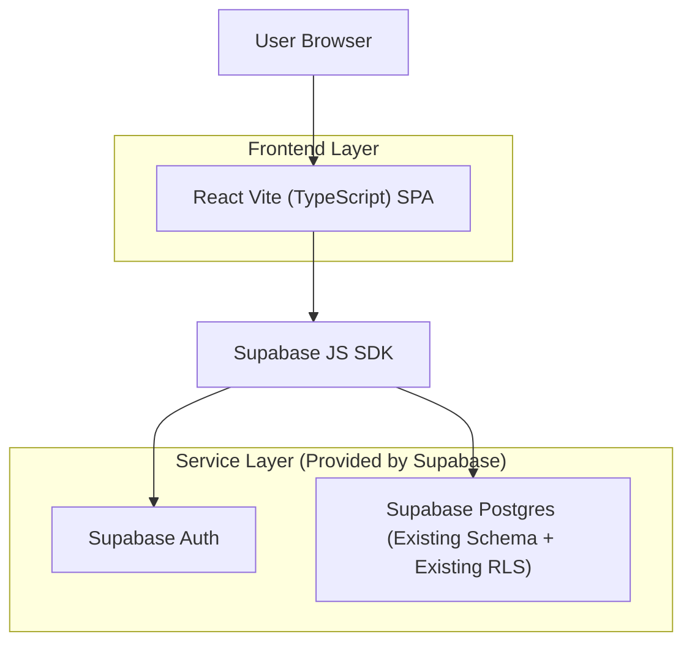

## 1.Architecture design

## 2.Technology Description
- Frontend: React@18 + TypeScript + vite
- Styling (recommended): tailwindcss@3
- Data fetching/caching (recommended): @tanstack/react-query
- Forms/validation (recommended): react-hook-form + zod
- Routing: react-router-dom
- Backend: None (Supabase accessed directly from the frontend via anon key + JWT)

## 3.Route definitions
| Route | Purpose |
|-------|---------|
| /login | Sign-in page using Supabase Auth |
| / | Gift issuing dashboard (lookup recipient, select gift, issue, view recent issues) |
| /issues/:issueId | Issue details page (read-only record view) |

## 4. Supabase integration notes (existing schema + existing RLS)
- The app uses `VITE_SUPABASE_URL` and `VITE_SUPABASE_ANON_KEY` to connect from the browser.
- Never expose `service_role` keys in the frontend.
- All database access must succeed through existing RLS policies; the frontend should not assume it can read/write rows unless the policy allows it.
- Recommended: generate typed database bindings from your existing Supabase schema (e.g., via Supabase CLI) and use those types in the React app.
- Prefer calling Postgres functions / RPC only if they already exist and are protected by RLS/SECURITY DEFINER rules that your security model permits.

## 5. GitHub repo initialization (practical checklist)
- Initialize and commit:
  - `git init`
  - add `.gitignore` (Node/Vite)
  - `git add . && git commit -m "init: react vite ts gift issuing app"`
- Create GitHub repo and push:
  - `git remote add origin <YOUR_REPO_URL>`
  - `git branch -M main && git push -u origin main`
- Recommended CI (GitHub Actions):
  - `npm ci` → `npm run lint` → `npm run build` (and tests if you have them)

## 6. Deployment considerations (SPA)
- Any static host that supports SPA rewrites works (e.g., Vercel/Netlify/Cloudflare Pages).
- Configure environment variables on the host:
  - `VITE_SUPABASE_URL`
  - `VITE_SUPABASE_ANON_KEY`
- Ensure “single-page app” routing fallback to `/index.html` so deep links like `/issues/:id` work.
- Validate that your deployed site origin is allowed by any auth redirect URL settings in Supabase Auth.
